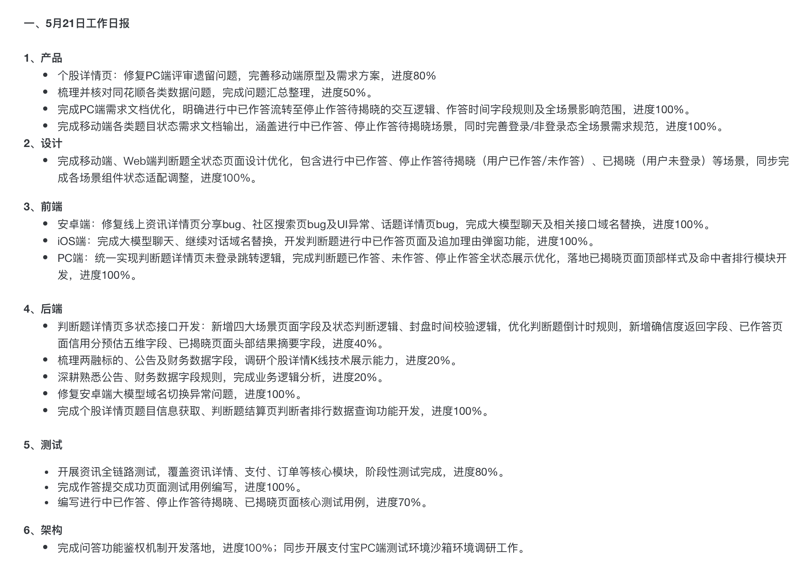

我参考了你提供的日报风格，为前端、后端、运维三个岗位分别定制了结构化模板，同时提供了一个通用版，你可以直接套用。

---

## 一、前端开发日报模板

适配你当前的项目场景，按「任务模块+进度+成果」的方式呈现，清晰可追溯。
```markdown
# 【XXXX项目】前端日报
日期：YYYY-MM-DD
填写人：XXX

## 一、今日完成事项
- **Android端**：修复资讯详情页分享bug、社区搜索页UI异常及话题详情页问题；完成大模型聊天及相关接口域名替换，进度100%。
- **iOS端**：完成大模型聊天、继续对话域名替换；开发判断题“进行中已作答”页面及追加理由弹窗功能，进度100%。
- **Web/PC端**：统一实现判断题详情页未登录跳转逻辑；完成判断题已作答、未作答、停止作答全状态展示优化；落地已揭晓页面顶部样式及命中者排行模块开发，进度100%。
- **通用优化**：完善移动端、Web端判断题全状态页面设计（含进行中/已揭晓/未登录场景），同步完成各场景组件状态适配调整，进度100%。

## 二、进行中事项
- 事项1：【任务名称】，进度XX%，关键进展/待解决问题：XXX
- 事项2：【任务名称】，进度XX%，关键进展/待解决问题：XXX

## 三、阻塞/风险问题
| 问题描述 | 影响范围 | 已采取措施 | 需协调资源 | 预期解决时间 |
|----------|----------|------------|------------|--------------|
| 例：第三方组件兼容性问题导致部分机型样式异常 | Android 10及以下机型 | 临时降级组件版本验证 | 后端/测试协助验证兼容性 | 202X-XX-XX |

## 四、明日计划
1.  推进【XX功能】开发，完成核心页面交互逻辑实现
2.  修复【XX模块】遗留bug，同步完成多端回归测试
3.  配合后端完成【XX接口】联调，优化接口响应渲染逻辑
```

---

## 二、后端开发日报模板
聚焦接口开发、数据处理、逻辑优化，体现业务闭环与技术细节。
```markdown
# 【XXXX项目】后端日报
日期：YYYY-MM-DD
填写人：XXX

## 一、今日完成事项
- **判断题模块**：新增判断题详情页多状态接口（四大场景字段、状态判断逻辑、封盘时间校验）；优化倒计时规则，新增确信度、信用分预估等返回字段；完成已作答页面摘要字段开发，进度40%。
- **Bug修复**：解决Android端大模型域名切换异常问题；完成个股详情页信息获取、判断题结算页判断者排行数据查询功能开发，进度100%。
- **业务梳理**：梳理两融标的、公告及财务数据字段，调研个股详情K线技术展示能力；深耕熟悉公告、财务数据字段规则，完成业务逻辑分析，进度20%。

## 二、进行中事项
- 事项1：【XX接口】开发，进度XX%，当前阶段：XXX（如：单元测试/联调阶段）
- 事项2：【数据字段梳理】，进度XX%，关键卡点：XXX

## 三、阻塞/风险问题
| 问题描述 | 影响范围 | 已采取措施 | 需协调资源 | 预期解决时间 |
|----------|----------|------------|------------|--------------|
| 例：第三方数据接口不稳定导致数据拉取超时 | 个股详情页数据加载 | 增加重试机制与降级方案 | 第三方供应商反馈跟进 | 202X-XX-XX |

## 四、明日计划
1.  完成【XX接口】剩余字段开发，输出接口文档
2.  配合前端完成【XX模块】联调，解决接口兼容问题
3.  推进【XX数据字段】梳理，完成业务逻辑文档输出
```

---

## 三、运维/架构日报模板
覆盖环境维护、部署发布、风险管控，突出稳定性与问题闭环。
```markdown
# 【XXXX项目】运维/架构日报
日期：YYYY-MM-DD
填写人：XXX

## 一、今日完成事项
- **架构开发**：完成问答功能鉴权机制开发落地，进度100%；同步开展支付宝PC端测试环境沙箱环境调研工作。
- **环境维护**：完成生产环境服务器日常巡检（CPU/内存/磁盘使用率、日志告警排查），无异常；完成【XX服务】版本发布，发布过程零故障。
- **配置优化**：调整Nginx反向代理规则，优化静态资源缓存策略；完成数据库备份任务执行，备份文件校验通过。

## 二、进行中事项
- 事项1：【沙箱环境搭建】，进度XX%，关键进展：XXX（如：调研完成，待申请资源）
- 事项2：【服务器扩容评估】，进度XX%，当前阶段：XXX

## 三、阻塞/风险问题
| 问题描述 | 影响范围 | 已采取措施 | 需协调资源 | 预期解决时间 |
|----------|----------|------------|------------|--------------|
| 例：服务器磁盘使用率过高（78%），预计3天后触发告警 | 生产环境稳定性 | 清理过期日志，临时扩容磁盘空间 | 研发协助优化日志输出策略 | 202X-XX-XX |

## 四、明日计划
1.  完成支付宝PC端沙箱环境搭建与验证，输出环境配置文档
2.  跟进【XX服务】扩容评估，制定扩容方案并提交审批
3.  开展【系统安全巡检】，修复低危漏洞，更新安全基线
```

---

## 四、通用极简版日报模板（快速填写）
适合团队内部快速同步，保留核心信息：
```markdown
【日期】YYYY-MM-DD | 【岗位】前端/后端/运维 | 【项目】XXX
1. 今日完成：
- 任务1：【动词+对象+结果】，进度XX%
- 任务2：【动词+对象+结果】，进度XX%
2. 明日计划：
- 计划1：XXX
- 计划2：XXX
3. 问题与协助：
- 问题：XXX，需【XX角色】协助XXX，预计解决时间XXX
```

---

💡 小建议：
1.  所有任务用「动词+对象+结果」的句式，比如“完成XX接口开发并通过单元测试”，比“做了XX接口”更清晰。
2.  阻塞问题一定要写清楚「影响范围、已做动作、需要什么帮助」，方便团队快速响应。

需要我根据你当前的具体项目，帮你把模板改成可直接复制的「今日内容」示例吗？


# 工作任务优化（规范、专业、可落地）
严格按照**岗位规范+清晰目标+可交付成果**优化，适合直接填入日报/周报/任务清单。

## 1 IM聊天 - 权限相关配置
**优化后**：完成IM聊天系统权限体系配置，包含用户权限校验、角色权限分配、接口访问权限控制，确保聊天功能权限安全、合规、可管控。

## 2 Dify - 配合金钥做Dify联网工作流细节
**优化后**：配合密钥完成Dify平台联网工作流全流程配置，细化API密钥接入、网络权限、流程节点、数据传输与安全校验，保障工作流稳定运行。

## 3 IM聊天 - 补全群聊和私聊相关接口
**优化后**：补全IM系统群聊+私聊全套业务接口，包含消息发送、接收、撤回、已读、群管理、私聊会话等接口开发与联调，实现聊天核心功能闭环。

## 4 社区后台 - IM用户管理，IM配置开关
**优化后**：完成社区后台IM用户管理模块开发，实现用户查询、状态管理、会话监控；搭建IM全局配置开关，支持功能启用/禁用、参数动态配置。

---

### 最终可直接复制的规范清单
```
1	IM聊天	    完成权限体系配置，实现用户/角色/接口权限校验与管控
2	Dify	    配合密钥完成联网工作流细节配置，保障流程安全稳定
3	IM聊天	    补全群聊+私聊全套业务接口，实现聊天核心功能闭环
4	社区后台	开发IM用户管理模块 + IM功能配置开关，支持后台统一管控
```

需要我帮你把这些内容**直接排版成你图片里的表格格式**吗？